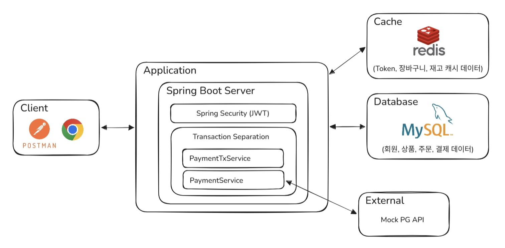
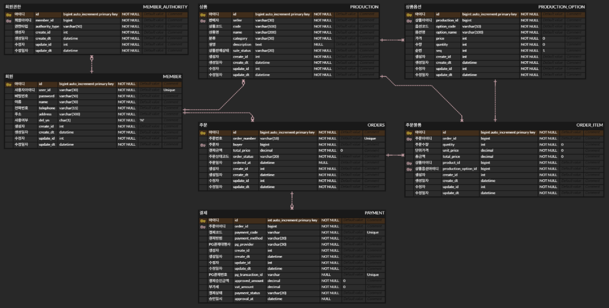
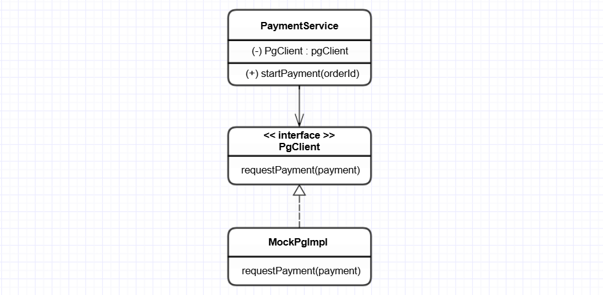
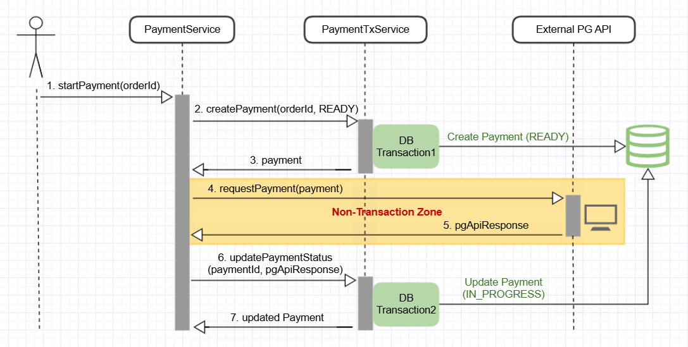

# MY E-COMMERCE PROJECT 
"변경이 두렵지 않은 구조"를 목표로
테스트 가능성과 객체지향 설계를 적용한 이커머스 백엔드 프로젝트입니다.   
 

---
## 1. Overview   
실무에서 경험한 Service 중심의 절차지향적 구조와 수동 테스트에 의존하는 개발 방식은
변경 영향 파악이 어렵고, 안정적인 리팩토링을 방해하는 문제를 발생시킵니다.   
이를 해결하기 위해 단순 기능 구현이 아닌, "지속적으로 수정 가능한 구조를 어떻게 만들 것인가"에 집중한 프로젝트입니다.

- Service에 집중 로직 → 도메인 중심 설계로 분산
- 수동 테스트 의존 → JUnit5 기반 테스트 자동화
- 변경 영향 파악 어려움 → 역할과 책임이 드러나는 구조 설계

인증 → 상품 → 장바구니 → 주문 → 결제 흐름을 구현했으며,
각 단계에서 발생할 수 있는 동시성, 데이터 정합성, 외부 의존성 문제를 구조적으로 해결합니다.   
 

---
## 2. Tech Stack
- Backend: Spring Boot, Java 17
- Database: MySQL, Redis
- Persistence: Spring Data JPA
- Security: Spring Security, JWT
- Test: JUnit5, Mockito, MockMvc
- Build: Gradle

### 기술의 선택 이유
1. **JPA**
    - 객체 중심 설계를 기반으로 도메인 모델링을 하기 위해 선택
    - 비즈니스 로직을 엔티티에 포함시키는 구조에 적합
2. **Redis**
    - 장바구니, 토큰과 같은 고빈도 I/O 데이터를 처리하여 RDB 부하 분산
    - 재고 캐시 계층 구축을 통한 RDB 부하 분산 
3. **JUnit5 & Mockito**
    - 테스트를 통한 설계 검증 및 빠른 피드백 사이클 확보
    - 리팩토링 시 안정성 보장   
 

---
## 3. Architecture
### 3-1. System Architecture

- **저장소 이원화 (MySQL & Redis):** 정합성이 필수적인 핵심 데이터(주문, 결제)는 MySQL에, 
  빈번한 I/O가 발생하는 데이터(장바구니, 토큰)는 Redis에 배치하여 RDB 부하 분산 및 응답 속도 극대화.

- **보안 및 인증 계층 독립성:** Redis 기반의 토큰 검증 구조를 통해 DB 조회 비용을 최소화하고, 
  서버의 상태를 유지하지 않는(Stateless) 구조를 채택하여 세션 방식 대비 확장성과 보안성 확보.

- **외부 시스템 결합도 완화 (DIP):** PG사 연동부를 인터페이스로 추상화하여 외부 장애 전파를 방지하고, 
  Mock 구현체 주입을 통해 외부 망 의존성 없는 독립적인 비즈니스 로직 테스트 환경 구축.

### 3-2. ERD

- **비식별 관계 :** 모든 테이블이 독립적인 PK(id)를 가지는 비식별 관계를 설계하여, 
  부모 데이터의 변경이 자식 식별자 구조에 영향을 주지 않는 유연한 데이터 구조 확보.

- **주문 데이터 무결성 (Snapshot):** 주문 시점의 상품 옵션과 가격을 Order_Item 테이블에 별도 기록하여, 
  원본 상품 정보가 변경되더라도 과거 주문 내역의 정합성이 훼손되지 않도록 설계.

- **결제 추적성 및 재시도 수용:** 주문과 결제를 1:N 관계로 설계하여 초기 결제 실패 후 재시도 시나리오를 수용하고, 
  외부 PG사의 승인 번호(pg_transaction_id)를 포함한 모든 시도 이력을 독립적으로 기록.

- **다중 권한 확장성:** 회원과 권한 체계를 분리하여 향후 구매자, 판매자, 관리자 등 복합적인 권한 할당이 가능한 구조 고려.   
 

---
## 4. Design Strategy & Implementation
본 프로젝트의 설계는 단순히 기능을 구현하는 것을 넘어,
발생할 수 있는 구조적 결함과 유지보수 문제를 해결해 나가는 과정을 담고 있습니다.

### 4-1. 초기 설계 목표
변경이 두렵지 않은 구조의 설계를 위해 
비즈니스 로직과 세부 구현의 결합도를 낮추어, 요구사항 변경에 즉각 대응 가능한 구조를 목표로 합니다.

#### 1. 서비스 로직의 기능 단위 분리   
   - 설계 배경: Service 내부에 DTO 변환, 유효성 검증, Entity 생성, 저장 로직 등이 모두 포함된 구조로 인해 로직 파악 및 수정 난이도 상승.   
   - 결정: Service는 비즈니스 흐름 조합 역할에 집중하고, 세부 로직은 메서드로 위임.
   - 구현: 특정 기능을 독립된 메서드로 분리하여 코드 가독성 향상   
          [[변경 과정 ProductService - registerProduct()]](https://github.com/geun02k/MyECommerce/pull/7/files#diff-0514dafdde336b4ac6e3e96da19c17171bb8b1040808268b5b737dbc6ce6714fR34-R61)   
          [[최종 개선 결과 ProductService - registerProduct()]](https://github.com/geun02k/MyECommerce/blob/main/src/main/java/com/myecommerce/MyECommerce/service/product/ProductService.java#L42-L65)
   - 의의: 기능 간 결합도를 낮춰 향후 Policy 분리 및 요구사항 변경에 유연하게 대응할 수 있는 기반 마련.   
    

#### 2. 테스트를 통한 변경 안정성 확보   
   - 설계 배경: 웹 요청 중심의 테스트로 인해 피드백 사이클이 느림.
   - 결정: 계층별 단위 테스트 도입 및 피드백 속도 최적화.
   - 구현: 외부 의존성 제거를 위한 Mockito 기반의 Service 로직 검증과 MockMvc 기반의 API 규약 검증으로 테스트 범위 이원화.   
          [[변경 과정 ProductServiceTest - successSaveProduct()]](https://github.com/geun02k/MyECommerce/pull/7/files#diff-56603b707aa6b5ecc1820c4673d2185eec20421e5d90f8f333f0a51789ebc34cR50-R191)   
          [[최종 개선 결과 ProductServiceTest - registerProduct_shouldInsertProductAndOption_whenValidProduct()]](https://github.com/geun02k/MyECommerce/blob/main/src/test/java/com/myecommerce/MyECommerce/service/product/ProductServiceTest.java#L138-L202)
   - 의의: '수정 -> 테스트 -> 검증' 사이클 단축하여 리팩토링 안정성을 확보.
    

### 4-2. 고도화
본 프로젝트는 문제 인식과 구조 개선을 반복하여 설계를 발전시켰습니다.
최초 설계에서 끝나지 않고, 
기능 구현 → 문제 인식 → 학습 → 구조 개선의 반복 과정을 통한 개선을 목표로 합니다.

#### 1. 관심사 분리(SoC)를 통한 검증 책임 분리
   - 설계 배경: Service 메서드가 단순 입력값 검증부터 복잡한 비즈니스 규칙 판단, 전체 실행 흐름 제어까지 모든 책임을 떠안으면서 코드 가독성이 저하되고 요구사항 변경 시 영향 범위 파악이 어려움.
   - 결정: 검증 성격에 따라 책임을 계층화.
   - 구현
     - 입력값 검증: Request DTO + Bean Validation을 활용해 컨트롤러 진입 단계에서 데이터 무결성 확보
     - 정책 검증: 비즈니스 규칙 위반 여부를 판단하는 전용 Policy 계층 도입.
     - 서비스 레이어: Policy를 호출하여 검증 결과를 확인하고 전체 유스케이스만 제어.
     > ex) 주문 생성 시 입력값 검증과 비즈니스 정책 검증 분리
     >- [[입력값 검증 - RequestOrderDto]](https://github.com/geun02k/MyECommerce/blob/main/src/main/java/com/myecommerce/MyECommerce/dto/order/RequestOrderDto.java#L12-L28)
     >- [[정책 검증 - OrderPolicy - validateCreate()]](https://github.com/geun02k/MyECommerce/blob/main/src/main/java/com/myecommerce/MyECommerce/service/order/OrderPolicy.java#L28-L53)
     >- [[OrderService - createOrder()]](https://github.com/geun02k/MyECommerce/blob/main/src/main/java/com/myecommerce/MyECommerce/service/order/OrderService.java#L36-L63)
   - 의의: 오류 발생 지점과 원인이 명확해져 에러 대응 및 예외 처리 효율 향상.
     정책 변경 시 서비스를 전체 분석할 필요없이 해당 Policy 객체만 수정하면 되므로 유지보수성 향상.   
    

#### 2. 의존성 역전(DIP) 기반의 구조 설계
   - 설계 배경: 결제 로직 작성 시 연동할 PG사를 확정하지 않은 상태였기 때문에, 
     특정 결제 API에 직접 의존하는 구조로 개발을 진행할 경우
     향후 PG사 변경 시 비즈니스 로직 전반에 수정이 발생할 수 있는 리스크 존재.
   - 결정: 외부 결제 시스템을 추상화 계층으로 분리하고, 구현체가 아닌 인터페이스에 의존하도록 설계.
   - 구현: 결제 기능을 정의한 PgClient 인터페이스를 설게하고, 개발 단계에서 MockPgClient를 사용하여 기능 구현해 
     Service 레이어에서는 pgClient 인터페이스에 의존하도록 구성.
     [[PgClient 인터페이스]](https://github.com/geun02k/MyECommerce/blob/main/src/main/java/com/myecommerce/MyECommerce/service/payment/PgClient.java#L9) | 
     [[MockPgClient 구현체]](https://github.com/geun02k/MyECommerce/blob/main/src/main/java/com/myecommerce/MyECommerce/service/payment/TestPgClientImpl.java#L25) | 
     [[PaymentService에서의 사용]](https://github.com/geun02k/MyECommerce/blob/main/src/main/java/com/myecommerce/MyECommerce/service/payment/PaymentService.java#L37)   
     
     - PaymentService: 비즈니스 로직을 담당하며, 인터페이스인 PgClient에 의존하는 구조.
     - PgClient: 결제 요청 기능을 추상화한 인터페이스.
     - MockPgImpl: 실제 PG사 연동을 대신할 테스트용 로직으로, 인터페이스 PgClient를 구현. 추후 실제 PG사로 구현체만 변경 가능.
   - 의의: PG사 미확정 상태에서도 개발을 병렬적으로 진행할 수 있는 유연한 구조 확보 및 테스트 환경에서 Mock 구현체를 활용해 외부 의존성 없이 안정적인 테스트 가능.
     또한 향후 실제 PG 연동 시 구현체만 교체하면 되므로 기존 비즈니스 로직 수정 불필요.   
      

#### 3. 도메인 중심 설계
   - 설계 배경: 기존 구조는 도메인 객체가 상태만 보유하는 빈약한 모델(Anemic Domain Model)로,
     비즈니스 로직이 서비스 계층에 집중. 
   - 결정: 핵심 도메인(주문, 결제)의 경우, 객체가 자신의 상태와 규칙을 스스로 관리하도록 설계.
   - 구현
     - **생성 책임 부여:** createPayment() 정적 팩토리 메서드를 통해 객체 생성 시점에 도메인 규칙 검증 수행. 
     - **상태 변경 제어:** requestPgPayment(), approve(), fail() 같은 상태 변경 메서드를 통해 
       허용된 흐름에서만 상태 변경이 가능하도록 제한.
     - **도메인 규칙 내재화:** PG 응답 검증, 결제 금액 검증 등 비즈니스 규칙을 Entity 내부에 포함.
     - **자기 상태 판단:** isTerminal(), isPgRequestAvailable() 등 상태 기반 판단 로직을 객체 내부에서 제공.    
     [[도메인 중심 설계 Payment]](https://github.com/geun02k/MyECommerce/blob/main/src/main/java/com/myecommerce/MyECommerce/entity/payment/Payment.java#L29)  
   - 의의
     - 비즈니스 로직이 도메인에 응집되면서 코드의 책임 명확화 및 가독성 향상. 
     - 상태 전이 흐름이 객체 내부에서 통제되어 잘못된 상태 변경을 사전에 방지.
     - 서비스 계층의 역할이 단순화되어 전체 구조의 유지보수성 향상.    
        

#### 4. 예외 처리 시스템의 구조적 개선 및 메시지 외부화
   - 설계 배경: 예외 객체가 응답 메시지 생성 책임까지 가지던 과도 설계(Over-engineering)와
     메시지 하드코딩으로 인해 가변 인자 대응 및 유지보수가 불가능한 구조적 한계.
       - ErrorCode가 메시지 생성까지 담당하며 계층 간 결합도 증가
       - BaseAbstractException이 행위 중심 구조로 설계되어 메시지 확장 어려움
       - ErrorCode / Exception / Handler 간 책임 중복으로 역할 불명확
       - HTTP 상태 코드가 명확한 기준 없이 사용되어 API 응답 의미 전달이 부족
   - 결정: Exception은 상태 전달, Handler는 메시지 조립을 책임을 명확히 분리.
     또한 ErrorCode의 메시지를 외부 리소스(properties)로 관리하고 HTTP 상태 코드는 의미 기반으로 재정의.
   - 구현
       - ErrorCode의 식별자화:
         HTTP 상태 코드와 메시지 키(Key)만 보유하도록 단순화하여 외부 리소스와의 결합을 끊음.   
         [[변경 과정 - CartErrorCode]](https://github.com/geun02k/MyECommerce/pull/15/files#diff-3f8531839a8fa68bdaac92dd9aca421a43d716c8f512049dfcf353b1b9b78884R11-R13)    
         [[최종 개선 결과 - CartErrorCode]](https://github.com/geun02k/MyECommerce/blob/main/src/main/java/com/myecommerce/MyECommerce/exception/errorcode/CartErrorCode.java#L14)
       - BaseException의 데이터 중심화:
         BaseAbstractException을 추상 메서드 중심에서 공통 상태(ErrorCode, messageArgs)를 관리하는 필드 중심의 베이스 클래스로 변경.
         이를 통해 예외가 가변인자를 전달할 수 있는 표준 규격 확립.   
         [[변경 과정 - BaseAbstractException]](https://github.com/geun02k/MyECommerce/pull/15/files#diff-77459cd78ed570b213e7672d13444370e3139f8ddbb74641b4aa72335a240eeeR7-R25) |
         [[변경 과정 - CartException]](https://github.com/geun02k/MyECommerce/pull/15/files#diff-7650349f69ab6145869c186caa4ce2928c0b8a496bd0517359b2b32a4d2d55b6R5-R15)    
         [[최종 개선 결과 - BaseAbstractException]](https://github.com/geun02k/MyECommerce/blob/main/src/main/java/com/myecommerce/MyECommerce/exception/BaseAbstractException.java#L20) |
         [[최종 개선 결과 - CartException]](https://github.com/geun02k/MyECommerce/blob/main/src/main/java/com/myecommerce/MyECommerce/exception/CartException.java#L5)
       - Handler로 메시지 생성 책임 위임:
         CommonExceptionHandler가 MessageSource를 활용해 예외에 담긴 키와 인자를 조합하여 최종 메시지를 동적으로 생성.   
         [[변경 과정 - CommonExceptionHandler]](https://github.com/geun02k/MyECommerce/pull/15/files#diff-180c5228f49298388439839e84dfd2a775b540d4abe87e33c46e66a1f8445f03R38-R57)   
         [[최종 개선 결과 - CommonExceptionHandler]](https://github.com/geun02k/MyECommerce/blob/main/src/main/java/com/myecommerce/MyECommerce/exception/handler/CommonExceptionHandler.java#L41)    
          

#### 5. 테스트 시나리오 확장 및 테스트 기반 명세화
   - 설계 배경: 초기 테스트는 정상 시나리오 중심으로 작성되어 하나의 테스트에 데이터 구성, 결과 검증 등 많은 책임이 포함되었고,
     내부 구현(Mapper, Repository)까지 함께 검증하면서 테스트 의도가 드러나지 않고 유지보수가 어려운 문제.
   - 결정: 테스트를 "모든 것을 검증하는 코드"에서 "핵심 책임을 검증하는 코드"로 전환.
     각 테스트는 하나의 책임과 시나리오만 검증하도록 분리하고, 테스트를 실행 가능한 요구사항 명세로 활용하도록 설계.    
   - 구현 
     1. 테스트 책임 분리: 정상 흐름, 실패 케이스, 책임(행위) 검증을 각각 독립적으로 구성.
     2. 검증 범위 최적화: Mapper, Repository 내부 구현 검증을 제거하고, 
        Service는 비즈니스 흐름과 책임 위임 중심 검증을 수행.
     3. 가독성 개선: @DisplayName을 요구사항 문장으로 작성 및 Fixture 메서드 도입으로 테스트 준비 코드 간소화.
     4. 계층별 테스트 분리
        - Service: 비즈니스 흐름 설명 및 책임 검증.
          [[비즈니스 흐름 설명 PaymentServiceTest - 결제시작 정상 시나리오]](https://github.com/geun02k/MyECommerce/blob/main/src/test/java/com/myecommerce/MyECommerce/service/payment/PaymentServiceTest.java#L185-L240) |
          [[책임 검증 PaymentServiceTest - 결제시작 시 객체 생성 책임 위임 검증]](https://github.com/geun02k/MyECommerce/blob/main/src/test/java/com/myecommerce/MyECommerce/service/payment/PaymentServiceTest.java#L242-L284)
        - Entity/Policy: 상태 전이 및 규칙 검증.
          [[상태 전이 검증 PaymentTest - 결제상태 전이 READY -> IN_PROGRESS]](https://github.com/geun02k/MyECommerce/blob/main/src/test/java/com/myecommerce/MyECommerce/entity/payment/PaymentTest.java#L198-L223) |
          [[정책 검증 PaymentPolicyTest - 본인 주문 외 결제 차단]](https://github.com/geun02k/MyECommerce/blob/main/src/test/java/com/myecommerce/MyECommerce/service/payment/PaymentPolicyTest.java#L237-L260)
        - Controller: API 요청/응답 및 Validation 검증.
          Validation, Security, ExceptionHandler를 포함한 API 계약 테스트 수행.
          [[API 요청/응답 검증 ProductControllerTest - 상품등록 성공]](https://github.com/geun02k/MyECommerce/blob/main/src/test/java/com/myecommerce/MyECommerce/controller/ProductControllerTest.java#L114) |
          [[API 계약 테스트 ProductControllerTest - 상풐코드 형식오류]](https://github.com/geun02k/MyECommerce/blob/main/src/test/java/com/myecommerce/MyECommerce/controller/ProductControllerTest.java#L141-L164)
        - Integration: 실제 동작 검증.
          [[결제시작 통합 테스트 PaymentStartIntegrationTest]](https://github.com/geun02k/MyECommerce/blob/main/src/test/java/com/myecommerce/MyECommerce/integration/payment/PaymentStartIntegrationTest.java#L114-L141)
        - Concurrency: 동시성 제어로 안정성 검증.
          [[결제시작 동시성 테스트 PaymentConcurrencyTest]](https://github.com/geun02k/MyECommerce/blob/main/src/test/java/com/myecommerce/MyECommerce/integration/payment/PaymentConcurrencyTest.java#L178-L251)
   - 설계 의의   
     - 테스트 코드만으로 비즈니스 흐름을 이해할 수 있는 구조 확보.
     - 구현 변경에 영향을 받지 않는 안정적인 테스트 구성.
     - 기능 변경 시 영향 범위를 빠르게 파악가능.    
    

#### 6. N+1 문제 해결
   - 설계 배경: JPA 지연 로딩 환경에서 연관된 Entity를 반복적으로 조회할 경우 N+1 문제 발생.
     결제 승인 웹훅 처리 과정에서는 Payment 조회 이후 Order 정보를 함께 사용하기 때문에,
     별도의 쿼리가 추가로 발생할 가능성 존재.
   - 결정: 연관된 Entity를 반드시 함께 사용하는 조회 로직에 대해 fetch join을 적용하여 단일 쿼리로 필요한 데이터를 모두 조회.
   - 구현: Payment 조회 시 Order를 함께 조회하도록 fetch join 적용. 
     fetch join을 사용해 한번에 상품 Entity와 상품옵션 Entity를 가져온다.
     ~~~
     public interface PaymentRepository extends JpaRepository<Payment, Long> {
         @Query("""
                   SELECT p
                   FROM Payment p
                   JOIN FETCH p.order
                   WHERE p.pgTransactionId = :pgTransactionId
         """)
         Optional<Payment> findByPgTransactionIdWithOrder(String pgTransactionId);
     }
     ~~~
   - 의의: 연관 Entity 조회 시 발생할 수 있는 N+1 문제를 사전에 차단하고,
     비즈니스 로직 수행에 필요한 데이터를 한 번의 쿼리로 조회하여 성능 최적화.
     또한 조회 시점의 쿼리 구조를 명확히 제어하여 예측 가능한 데이터 접근 구조 확보.   
      

#### 7. 장애 전파 방지를 위한 트랜잭션 분리
   - 설계 배경: 결제 프로세스는 외부 PG API 호출과 DB 상태 변경이 함께 이뤄지는 구조로,
     이를 하나의 트랜잭션으로 처리할 경우 외부 시스템 지연이 내부 DB 자원 점유하는 문제 발생으로
     커넥션 풀 고갈 및 전체 서비스 장애로 확산될 수 있는 구조적 위험 존재.
   - 결정: 외부 API 호출과 DB 트랜잭션을 분리하고, DB 작업은 짧은 트랜잭션 단위로 나누어 처리.
   - 구현: PaymentService는 흐름 제어 및 외부 API 호출을 담당하고, 
     PaymentTxService는 @Transactional 기반으로 DB 처리를 전담.
     
     ~~~
     /** 결제 생성 - 결제 시작 **/ 
     public ResponsePaymentDto startPayment(...) {
         // 트랜잭션1 - 결제 생성
         Payment payment = paymentTxService.createPayment(...);

        // 트랜잭션 외부 - 외부 API 호출
        PgApiResponse<PgResult> pgResponse = pgClient.requestPayment(payment);
        if (pgResponse.isSuccess()) {
            // 트랜잭션2 - 결제 상태 변경
            payment = paymentTxService.updatePaymentToInProgress(...);
        }
        return ResponsePaymentDto.from(payment, pgResponse);
     }
     ~~~
   - 의의: Service 레이어와 트랜잭션 레이어 분리를 통해 
     외부 API 지연 상황에서도 DB 커넥션 점유 시간을 최소화하여 시스템 안정성 확보하고,  
     트랜잭션 범위를 축소하여 장애가 전체 서비스로 전파되는 것을 방지.   
      

#### 8. 데이터 정합성 보장을 위한 동시성 제어 전략 
   - 설계 배경: 결제 승인 및 웹훅 처리 과정에서 동일 요청의 중복 실행 또는 동시성 환경에서의 상태 경쟁 발생 가능.
   이로 인해 중복 결제, 상태 불일치 등의 데이터 정합성 문제 발생 가능.
   - 결정: 동시 요청 상황에서 하나의 요청만 성공하도록 제어하기 위해,
     상태 기반으로 조건부 업데이트를 수행하여 동일 요청이 반복되더라도 결과가 변하지 않도록 멱등성 보장.
   - 구현 
     [[결제생성 웹훅 처리 PaymentService - handlePgWebHook]](https://github.com/geun02k/MyECommerce/blob/main/src/main/java/com/myecommerce/MyECommerce/service/payment/PaymentService.java#L48-L70)
     - **상태 기반 조건부 업데이트:** 특정 상태(IN_PROGRESS)일 때만 업데이트를 수행하여 동시 요청 시 하나의 요청만 성공하도록 보장.
       상태가 업데이트 되지 않는다면, 다음 로직은 실행되지 않도록 결제 종료.
       ~~~
       public interface PaymentRepository extends JpaRepository<Payment, Long> {
           // 조건부 결제상태 업데이트
           @Modifying(clearAutomatically = true, flushAutomatically = true)  // Spring Data JPA에서 변경 쿼리임을 알려주는 어노테이션
           @Query("""
                     UPDATE Payment p
                     SET p.paymentStatus = :status
                     WHERE p.id = :id
                     AND p.paymentStatus = 'IN_PROGRESS'
           """)
           int approveIfInProgress(Long id, PaymentStatusType status);
           }
       } 
       ~~~
     - **멱등성 보장:** 이미 종결된 결제는 추가 처리하지 않도록 해, 동일 웹훅이 여러 번 들어와도 결과 일관성 유지.
       ~~~ 
        // 결제 승인, 실패 처리 (동시성 제어)
        int updateCnt = updatePaymentApprove(payment, pgApprovalResult);
        if (updateCnt == 0) {
            return; // Spring은 200 OK를 보내 pg 승인결과 반영 재요청 받지 않게 종료.
        }
       ~~~
     - **비관적 락 기반 선점 제어:** 결제 및 주문 조회 시 PESSIMISTIC_WRITE 락을 적용해 
       동일 자원에 대한 동시 접근을 차단하여 정합성 확보.
       [[결제를 위한 주문 조회 PaymentTxService - createPayment()]](https://github.com/geun02k/MyECommerce/blob/main/src/main/java/com/myecommerce/MyECommerce/service/payment/PaymentTxService.java#L43-L46)
       ~~~
       public interface OrderRepository extends JpaRepository<Order, Long> {
           // 생성된 상태의 주문 조회
           @Lock(LockModeType.PESSIMISTIC_WRITE)
           Optional<Order> findLockedByIdAndOrderStatus(Long id, OrderStatusType orderStatus);
       }
       ~~~
    

#### 9. 상품 옵션 시스템 식별 체계 개선
   - 설계 배경: 상품코드가 전역 식별자가 아니므로, 기존 Redis Key는 productCode-optionCode를 기반으로 구성되어 있어 서로 다른 판매자가 동일한 상품코드를 사용할 경우 Key 충돌 가능성 존재.
     이를 검증하기 위해 테스트를 작성하는 과정에서 문제의 원인이 Redis Key가 아니라 시스템 전반에서 비즈니스 식별자와 시스템 식별자가 혼용되고 있다는 점임을 확인.
   - 결정: Product 도메인에서는 Business Key를 사용하고, 다른 도메인의 상품/옵션 참조 및 Redis 등 저장소의 식별 키에는 시스템 식별자인 PK를 사용하도록 역할을 분리.
   - 구현
     - 상품옵션 중복 검증 시 seller 조건 추가  
       [[상품옵션 중복 검증 - ProductPolicy.validateRegister()]](https://github.com/geun02k/MyECommerce/blob/main/src/main/java/com/myecommerce/MyECommerce/service/product/ProductPolicy.java#L40-L42) 
     - 상품 및 상품옵션 복합 Unique 제약 추가   
       [[상품 Unique 제약 - Product]](https://github.com/geun02k/MyECommerce/blob/main/src/main/java/com/myecommerce/MyECommerce/entity/product/Product.java#L12-L19)
       [[상품옵션 Unique 제약 - ProductOption]](https://github.com/geun02k/MyECommerce/blob/main/src/main/java/com/myecommerce/MyECommerce/entity/product/ProductOption.java#L11-L14)   
     - Redis 재고 및 장바구니 Key를 optionId 기반으로 변경  
       [[재고 Redis Key - StockCacheService]](https://github.com/geun02k/MyECommerce/blob/main/src/main/java/com/myecommerce/MyECommerce/service/stock/StockCacheService.java#L36)
       [[장바구니 Redis Hash Key - CartService]](https://github.com/geun02k/MyECommerce/blob/main/src/main/java/com/myecommerce/MyECommerce/service/cart/CartService.java#L60)
     - 주문 생성 및 재고 처리 로직을 optionId 기반으로 변경  
       [[주문 로직 변경 과정 - OrderService]](https://github.com/geun02k/MyECommerce/blob/main/src/main/java/com/myecommerce/MyECommerce/service/order/OrderService.java#L81-L87)
       [[재고 로직 변경 과정 - StockCacheService]](https://github.com/geun02k/MyECommerce/blob/main/src/main/java/com/myecommerce/MyECommerce/service/stock/StockCacheService.java#L36)
     - 테스트를 optionId 기반으로 개선하여 상품 식별자 변경에 따른 데이터 연결 검증 강화 
       [[상품옵션 optionId 연결 검증 - OrderCreateIntegrationTest]](https://github.com/geun02k/MyECommerce/blob/main/src/test/java/com/myecommerce/MyECommerce/integration/order/OrderCreateIntegrationTest.java#L303-L331)
       [[장바구니 optionId 조회 검증 - CartAddIntegrationTest]](https://github.com/geun02k/MyECommerce/blob/main/src/test/java/com/myecommerce/MyECommerce/integration/cart/CartAddIntegrationTest.java#L140-L159)
   - 의의: 비즈니스 식별자(seller + productCode, optionCode)는 도메인 의미를 표현하는 용도로 유지하고,
     다른 도메인의 참조와 Redis Key에는 시스템 식별자인 productId, optionId를 사용하도록 역할을 분리. 
     이를 통해 식별 기준이 명확해졌으며 Redis, 주문, 장바구니, 재고 처리에서 동일한 시스템 식별자를 사용해 유지보수성과 일관성 향상.
    

---
## 5. Key Features
이커머스의 핵심 도메인인 재고, 주문, 결제에서 데이터 정합성과 시스템 안정성을 확보하는 데 집중했습니다. 

### 5-1. 전략적 재고 관리    
   단순 DB 조회의 한계를 극복하기 위해 Redis 캐시 계층을 두어 성능과 정합성을 동시에 고려했습니다.
   - **동기화 시점:** 상품 등록 및 신규 옵션 추가 시점에 Redis에 옵션별 재고 데이터를 즉시 생성.
   - **성능 최적화:** 장바구니 조회나 상품 목록의 실시간 품절 여부 확인 시, RDBMS I/O를 발생시키지 않고 
     Redis 데이터만으로 빠르게 응답하여 사용자 경험을 개선.
   - **데이터 정제:** 상품이 '판매 중단' 또는 '판매 종료' 상태로 변경될 경우, 불필요한 메모리 점유 방지를 위해 캐시 재고 즉시 삭제.
   - **제약 사항:** 재고 데이터의 무결성을 위해 상품 수정 시 기존 옵션의 수량 변경은 제한하며, 
     재고 추가가 필요한 경우 신규 옵션 추가 프로세스를 따르도록 강제.

### 5-2. 비즈니스 로직 중심의 주문 생성
   주문 생성 과정에서 비즈니스 규칙을 적용하고 데이터의 신뢰성을 확보했습니다.
   - **재고 선점 및 차감 프로세스:** 다수의 사용자가 동시에 주문할 때 발생할 수 있는 초과 판매를 방지하기 위해,
     주문 시점에 실시간으로 재고를 선점하고 DB 캐시(Redis)의 수량을 동기화하여 정확한 판매 수량을 관리.
   - **제약 사항:** 판매 중인 상품만 주문 가능, 최소/최대 주문 수량 제한 등 주문 규칙 설정.

### 5-3. 안정적인 결제 파이프라인    
   결제 도메인은 외부 시스템 의존성이 높기 때문에 결제 시도 이력 관리와 웹훅 기반의 상태 정합성에 집중했습니다.
   - **결제 이력 기반의 재시도 허용**    
     결제 수단 변경이나 승인 실패 등 다양한 변수에 대응하기 위해, 하나의 주문에 대해 여러 건의 결제 시도 이력을 관리하도록 설계.   
     결제 시작 시점에 READY 상태의 데이터를 즉시 INSERT하여 모든 시도 과정을 추적할 수 있게 구축.
   - **비동기 웹훅 기반 상태 동기화**   
     PG사의 결제 승인 결과를 웹훅(Webhook)으로 수신하여 처리.
     수신 시 결제 트랜잭션 ID를 통해 해당 건을 조회하며,   
     승인이 확인되면 결제 상태를 APPROVED, 주문 상태를 PAID로 최종 변경하여 데이터 최종 정합성을 확보.
   - **멱등성을 고려한 응답 제어**    
     동일한 승인 결과가 중복 수신될 경우를 대비해, 
     이미 주문이 PAID 상태이거나 결제가 IN_PROGRESS가 아닌 종결된 상태라면 로직을 수행하지 않고 200 OK를 즉시 반환.
     이를 통해 불필요한 재요청을 방지하고 시스템 자원을 보호.
   - **플러그인 구조의 인터페이스 설계**    
     PG 시스템이 확정되지 않은 상황을 고려해 PgClient 인터페이스를 도입.   
     결제 요청 후 성공 시 IN_PROGRESS로 상태 UPDATE 및 redirectUrl 반환 등 공통 흐름을 정의해,
     추후 실제 PG사 변경 시에도 서비스 로직 수정이 없는 유연한 확장 가능.   
 

---
## 6. Getting Started
### 6-1. Prerequisites   
   로컬 환경에서 실행하기 위해 아래의 인프라가 설치 및 실행 중이어야 합니다.
   - Java 17 (Amazon Corretto 17 권장)
   - MySQL 8.0 (Database: zero_my_e_commerce 생성 필요, 포트 3306)
   - Redis 3.0 (포트 6379)   

### 6-2. Configuration & Security
본 프로젝트는 Jasypt를 활용하여 주요 설정 정보(DB 접속 정보, JWT Secret 등)를 암호화하여 관리합니다.
   - **암호화 설정**    
     모든 암호화 값은 ENC(...) 형식으로 application.properties에 정의되어 있습니다.
   - **복호화 키**    
     현재 로컬 실행 편의를 위해 JasyptConfigAES.java 내에 마스터 키가 포함되어 있습니다.
   - **개인 환경 대응**     
     로컬 DB 계정 정보가 프로젝트 설정과 다를 경우, 해당 설정값을 본인의 환경에 맞춰 수정하여 실행하세요.
     1. **암호문 생성**   
        src/test/java/.../SecretPropertyGenerator.java 에서 평문을 수정 후 실행합니다.
     2. **설정 파일 수정**
        메서드 실행 후 콘솔에 출력된 ENC(...) 결과값을 복사하여 application.properties에 붙여 넣습니다.
   - **운영 권장 사항**     
     실제 운영 환경에서는 보안을 위해 암호화된 평문 정보 파일인 application-secrets.properties를 외부에서 별도 관리를 권장합니다.
     또한 소스 코드 내의 마스터 키를 제거하고, 실행 시 시스템 환경변수(-Djasypt.password=...)를 통해 주입하는 것을 권장합니다.
   - **DB 스키마**    
     테스트 및 초기 실행 편의를 위해 spring.jpa.hibernate.ddl-auto: create-drop 모드를 사용 중입니다.

### 6-3. Build and Run   
   터미널에서 프로젝트 루트 폴더로 이동하여 아래의 명령어를 실행합니다.
   반드시 Redis 서버가 실행 중인 상태여야 빌드가 성공합니다.
   ~~~
   # 1. 빌드 및 테스트
   # Mac / Linux
   ./gradlew test
   # Windows (PowerShell)
   .\gradlew test

   # 2. 애플리케이션 실행
   # Mac / Linux
   ./gradlew bootRun
   # Windows (PowerShell)
   .\gradlew bootRun
   ~~~

---
## 7. Results
본 프로젝트가 실제 코드에서 어떻게 안전하게 작동하는지 테스트와 지표로 검증한 결과입니다.   

![[Test Results]](./output/test-result.png)

### 7-1. 비즈니스 로직 신뢰성 검증 (Test Coverage)    
   핵심 도메인 로직에 대해 단위 테스트와 통합 테스트를 병행하여 비즈니스 규칙의 무결성을 검증했습니다.
   - 주문 생성 파이프라인: 상품 상태 확인, 최소/최대 수량 검증 등 운영 정책이 누락없이 적용됨을 확안.
   - 엣지 케이스 대응: 재고 부족, 유효하지 않은 결제 상태 등 예외 상황 발생 시 의도한 대로 트랜잭션 롤백 및 예외 처리가 발생하는지 검증.

### 7-2. 동시성 제어 및 데이터 정합성 테스트    
   다수의 사용자가 동시에 동일 상품을 주문하는 상황을 가정하여 멀티스레드 테스트를 수행했습니다.
   - 테스트 시나리오: 10개의 스레드가 동시에 1개의 재고를 선점하려고 시도.
   - 결과: 비관적 락을 통해 경쟁 상태를 방지하고, 최종 재고가 정확히 0이 되는 데이터 무결성을 확인.

---
## 8. Feature Roadmap
### 8-1. 최우선 과제
   - [ ] **외부 웹훅 처리 시 비관적 락을 통한 이중 결제 방지**
       - 현재: 결제 웹훅 처리 시 결제 Entity의 상태를 조건부 업데이트하여 멱등성을 보장하고 있으나,
         동일 주문에 대해 서로 다른 결제 수단으로 동시에 승인이 올 경우 주문 상태의 정합성이 깨질 위험 존재.
       - 개선 계획: 웹훅 진입 시점에 pgTransactionId로 연관된 주문을 비관적 락으로 선점.
         주문 상태를 선 검증하고 결제 승인 로직의 원자성을 보장하여,
         네트워크 중복 호출이나 동시 결제 시도 환경에서도 단 한번의 결제만 승인되도록 구조 고도화.

### 8-2. 개선 과제
   - [ ] **Redis 네임스페이스 분리를 통한 테스트 환경 격리**
       - 현황: 현재 재고 서비스의 Redis 키 네임스페이스가 단일화되어 있어, 테스트 수행 시 발생한 캐시 데이터가 실제 서비스 데이터에 영향을 주거나 잔류 위험 존재. Redis는 RDBMS와 달리 테스트 종료 후 자동 롤백이 되지 않으므로 명시적인 관리가 필요.
       - 개선 계획: application.properties를 활용하여 환경별 네임스페이스(Namespace)를 분리 관리. 이를 통해 테스트 데이터의 생성·삭제 범위를 명확히 격리하고, 기존 운영 데이터의 오염 없이 독립적인 테스트가 가능한 환경 구축.   
          
     
   - [ ] **정책(Policy) 계층의 순수성 확보 및 DIP 적용**
       - 현재: 프로젝트 중반에 도입된 정책 분리 패턴이 일부에만 적용되어 일관성이 부족하며, 특히 정책 로직이 Repository에 직접 의존하여 조회 같은 인프라(조회 방식) 변경 시 정책 코드가 함께 수정되는 높은 결합도 발생.
       - 개선 계획: 모든 도메인에 Policy 계층을 일괄 적용하고, 외부 의존성을 제거하여 도메인 모델의 순수성 유지. 만약, 전달받을 조회 변수가 많다면, OrderCreateContext를 도입하여 정책은 전달받은 데이터로 판단만 수행하도록 격리.   
          
     
   - [ ] **테스트 커버리지 및 유지보수성/품질 고도화**   
     상태 하나가 추가될 때마다 메서드를 만드는 번거로움과 성공 케이스만 존재하는 기존 테스트의 보강이 필요합니다.
       - 현재: 정상 시나리오 케이스에 치중되어 있으며, 테스트 데이터 생성 시 상태별로 개별 메서드를 구현하여 중복 코드 증가.
       - 개선 계획: 경계값 분석 기반의 실패 케이스 및 웹 계층 테스트 보강하고, Fixture Builder 패턴을 도입하여 메서드 체이닝 방식으로 가독성 있게 객체를 생성.   
          

   - [ ] **분산 환경에서의 재고 데이터 정합성 확보**   
     RDBMS와 Redis 간의 상태 불일치 및 재고 점유 문제 해결이 필요합니다.
       - 현재: Redis 재고 데이터는 RDBMS와 달리 롤백이 불가하여 장애 발생 등의 사유로 정합성이 깨질 수 있으며, 결제 미완료 주문에 의한 불필요한 재고 점유 발생.
       - 개선 계획: 재고 동기화 Batch를 이용해 주기적으로 DB와 캐시 데이터를 비교 검증하여 최종 정합성을 맞추는 프로세스 구축. 특히 특정 시간 내 결제 미완료 시 재고 점유를 해제하는 스케줄러를 도입해 자동 주문 취소 처리.   
          

   - [ ] **QueryDSL 도입을 통한 동적 쿼리 유지보수성 강화**   
     현재 JPA 메서드 기반 쿼리의 동적 쿼리 처리 한계를 극복하고, 컴파일 타임 타입 체크를 통해 영속성 계층의 유지보수성 강화하겠습니다.
       - 현재: ProductOptionRepositoryImpl 에서 JPQL 문자열 조립(StringBuffer)을 통해 동적 쿼리를 처리. 이는 컴파일 시점의 오류 체크가 불가능하고 코드 가독성이 현저히 떨어짐.
       - 개선 계획: QueryDSL을 도입하여 자바 코드로 타입 안정성(Type-Safe)이 보장된 동적 쿼리 구현. 문자열 기반 쿼리의 런타임 에러 위험을 제거하고 유지보수 생산성 극대화.   
          

   - [ ] **운영 안정성을 위한 로깅 표준화 및 관심사 분리를 위한 AOP 적용**   
     단순 콘솔 로그 의존에서 벗어나, 운영 환경에서 장애를 즉각적으로 추적하고 비즈니스 지표를 관리할 수 있는 체계적인 로깅 기반을 마련을 목표로 합니다.
       - 현재: 별도의 로깅 전략 없이 예외 발생 시 콘솔 로그에만 의존하여 디버깅을 수행.
         이는 서비스 운영 시 장애 원인 파악 및 히스토리 추적에 한계를 가짐.
       - 개선 계획: Slf4j를 활용해 로직의 중요도에 따른 로그 레벨을 정의하고 에러 추적성 확보.
         또한 메서드 실생 시간, 파라미터 등 반복적으로 발생하는 로깅 요구사항을 Spring AOP(Aspect)로 모듈화해
         비즈니스 로직과 운영 로직을 분리하여 코드 순수성을 유지하고 유지보수 효율성 증대.   
          

   - [ ] **인증 아키텍처 고도화**
       - 현재: JWT 검증 시마다 Redis를 조회하는 구조로 인해 중앙 저장소 의존도가 높고, 매 요청마다 발생하는 네트워크 I/O로 인해 전체적인 시스템 성능 저하 우려.
       - 개선 계획: Access Token은 서버 자체에서 Stateless하게 검증하고, 만료 시에만 Redis를 참조하는 Refresh Token 전략을 도입하여 인증 성능과 보안성 강화.   
          

