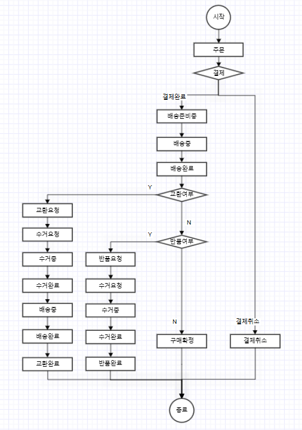
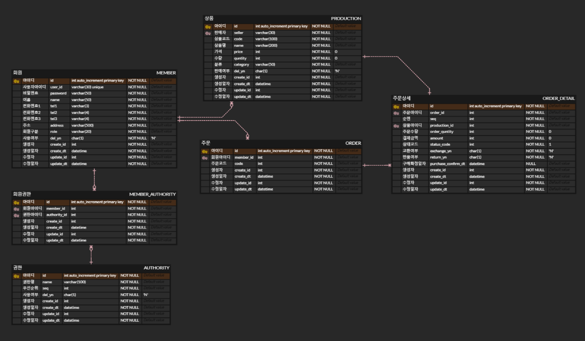

# MY E-COMMERCE PROJECT
2025 간단한 이커머스 서비스

## 개요
    간단한 이커머스 서비스 제공 프로젝트.

    Goal : 상품을 구입가능한 서버를 구축한다.

    Use : Spring Boot
          Java 17
          Jpa
          Database - RDB : Mysql
          Build - Gradle
          Spring Security
          Login Token - JWT
          Test - Junit5
          Test UI - PostMan

    산출물 :  DB ERD, api 문서

## < 프로젝트 스터디 목표 >
### 1. 필수목표 
> - [ ] 테스트코드 작성
>   - 일일이 api를 호출하지 않고 기능의 정확성을 확인하기 위해
> - [ ] JWT토큰 및 스프링 시큐리티 사용을 통한 인증,인가
>   - 인증, 인가되지 않은 사용자의 접근을 막기위해
> - [ ] redis를 이용한 캐싱
>   - 조회속도 높이기 위해
> - [ ] redis를 이용한 동시성 제어
>   - 결제가 동시에 발생하지 않도록 하기위해
> - [ ] 스프링 배치 사용하기
>   - 일정시간마다 반복하는 기능 만들기
> - [ ] 로그파일생성
>   - 모니터링을 위한 로그파일 생성하기 

### 2. 추가목표
> - [ ] 소셜로그인
>   - 사용자가 로그인을 좀 더 쉽게 진행하기 위해
> - [ ] 이미지 파일업로드
>   - AWS S3를 이용한 클라우드 서버에 저장 -> 1년 무료이기 때문에 추후 로컬 서버컴퓨터에 저장하도록 변경해보기
> - [ ] 회원가입 시 추가 인증절차 진행
>   - 이메일 또는 전화번호를 이용한 본인확인 인증절차 진행 후 회원가입 완료되도록 처리하기
> - [ ] 간단한 정산처리
>   - 배치 순차처리 및 정산처리로직 만들어보기 

## < 프로젝트 요구사항 정의 >
### 1. 기본구현기능
    필요 테이블 : 회원테이블(판매자,고객 동시관리), 회원별권한테이블, 권한테이블, 
                 상품테이블, 주문테이블, 주문상세테이블

#### 공통
- [ ] **로그인**
    - [ ] 아이디, 패스워드 정보가 일치해야 로그인 가능
    - [ ] 로그인 시 토큰 발생
    - [ ] 로그인 시 토큰을 이용한 접근권한제어
        - 로그인하지 않은 고객은 상품 조회만 가능.
        - 로그인한 회원은 상품조회 외 페이지 접근가능. (단, 권한에 따른 접근페이지 상이)
        - JWT, Filter 이용해 간략하게 진행
- [ ] **로그아웃**
    - [ ] 생성된 토큰 삭제로 로그아웃처리(?)
- [ ] 회원정보 수정
- [ ] 회원정보 삭제
- [ ] 회원정보 조회
- [ ] 로그생성
    - ERROR 로그 파일 별도 생성.
    - ERROR 외 로그 파일 생성.
    - 파일이 일정 사이즈에 도달하는 경우 새로운 로그파일 생성.
    - 자동 일자별 로그파일 압축.
    - 일자별 로그파일 최대 보관주기(~일), 해당 설정일 이상된 파일은 자동으로 제거.

---
#### 판매자
- [ ] 파트너(회원) 가입 
    - 회원 아이디는 unique.
    - 회원가입 시 SELLER(판매자) 권한 부여. 
- [ ] 상품 등록 
    - 파트너 회원가입 후 등록가능.
- [ ] 상품 수정
    - 판매자 본인이 등록한 상품만 수정가능.
- [ ] 상품 삭제 
    - 판매자 본인이 등록한 상품만 삭제가능. 
- [ ] 주문내역 조회
    - 날짜별 시간 테이블 목록 확인가능.
    - 상품 본인이 등록한 상품에 대한 주문내역만 조회가능.
- [ ] 주문 알림 
    - 10분 마다 결제완료된 상품이 있는 판매자에게 알림 전송. (배치처리)

- [ ] 주문상태 수정 (배송관련처리)
    - 배송준비중
    - 배송중
- [ ] 주문상태 수정 (반품관련처리)
    - 수거요청
    - 수거중
    - 반품완료
- [ ] 주문상태 수정 (교환관련처리)
    - 수거요청
    - 수거중
    - 배송중
    - 교환완료

---
#### 고객
- [ ] 회원 가입
    - 회원 아이디는 unique.
    - 회원가입 시 CUSTOMER(소비자) 권한 부여.
- [ ] **상품 검색**
    - 키워드를 입력받아 LIKE 검색.
    - 조회 시 5건 출력.
- [ ] 상품상세정보 조회
    - 로그인하지 않은 사용자도 조회가능. 
- [ ] **장바구니에 상품추가**
    - 로그인 한 회원만 장바구니에 상품추가 가능.
    - redis 캐싱 기능 이용해 구현.
- [ ] **장바구니에서 상품삭제**
    - redis 캐싱 기능 이용해 구현.
- [ ] **장바구니 상품목록 조회**
    - redis 캐싱 기능 이용해 구현.
- [ ] 상품 주문
    - 상품주문은 상품상세정보 페이지에서 가능.
    - 상품주문을 위해 회원가입 필수.
    - 상품주문 시 필요정보 : 상품, 주문자, 주문일시
- [ ] 상품 결제
    - PG사 연동 결제 api를 이용한 결제서비스 생성해 결제진행.
    - 동시성제어 필요여부확인. 
    - 참고블로그   
      https://velog.io/@jonghyun3668/%EA%B2%B0%EC%A0%9C-%EA%B3%BC%EC%A0%95-%EC%9D%B4%ED%95%B4%ED%95%98%EA%B8%B0PG%EC%82%AC-%EC%97%B0%EB%8F%99
    - 결제 완료 후 주문상태 '결제완료'로 변경.

- [ ] 상품 주문취소
    - 결제완료되고 배송중이지 않은 상품에 대해 결제취소가능.
- [ ] 상품 교환신청
    - 배송완료된 상품에 대해 교환신청가능. (교환요청)
- [ ] 상품 반품신청
    - 배송완료된 상품에 대해 반품신청가능. (반품요청)

---
#### 배송업체
- [ ] 회원 가입
    - 회원 아이디는 unique.
    - 회원가입 시 PARTNER(협력사) 권한 부여.
- [ ] 배송중인 상품에 대한 배송완료처리
    - 간단히 협력사에서 배송상태를 '배송완료' 처리하는 것으로 배송완료. (배송완료)
- [ ] 주문상태 수정 (반품,교환 관련처리)
  - 수거완료

  
## < 주문 프로세스 FLOW CHART >

    

## < DB ERD >
ERD 편집 : https://www.erdcloud.com/d/LuE5DFSZNinSPhYMe

